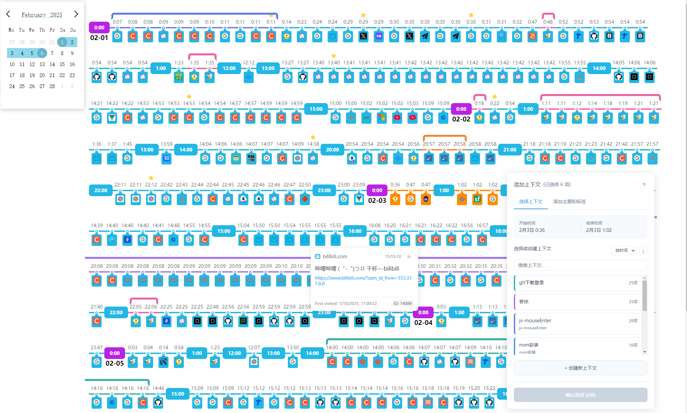

# 🚀  告别标签页地狱！你的个人知识宇宙飞船 🌌

你是否也曾陷入这样的困境？

*   🤯  浏览器标签页越开越多，电脑卡顿到爆炸？
*   😫  想找回之前看过的某个神仙网站，却在历史记录里翻到天荒地老？
*   📚  学习资料、技术文档、灵感网页… 散落在浏览器各处，难以有效组织和回顾？

**别担心！你的救星来了！**  🎉

**Web-Assistant**  是一款为你量身打造的 **个人知识管理神器**，带你穿梭于信息海洋，高效管理你的数字知识，让你的学习和工作效率 **瞬间起飞！** 🚀

**🌟  核心功能，让你惊呼 Awesome!**

*   **🔥  时间线可视化浏览历史：**  告别冰冷的列表！我们用 **炫酷的时间线**，以小时为单位，直观呈现你一整天的浏览轨迹，让你像电影一样回顾你的学习探索历程！
*   **🌈  上下文标记，工作流记忆神器：**  研究 Bug？学习新框架？撰写报告？  **颜色标记上下文**，一键记录你的工作流，下次需要时，瞬间回到当时的工作状态，效率爆表！
*   **🏷️  标签 & 主题，知识分类井井有条：**  为网页添加 **标签** 和 **主题**，构建你的 **专属知识图谱**！  告别信息混乱，让知识井然有序，随时精准检索！
*   **⭐  一键收藏，重要链接永不丢失：**  重要的网页，一键 **收藏**！  再也不用担心信息沉没在历史记录的汪洋大海中！
*   **🔍  强大的信息卡片：**  鼠标悬停，**网页标题、链接、访问信息、标签、主题、笔记**…  所有信息一览无余，快速回顾网页内容！
*   **⚡️  批量操作，效率 Double Kill：**  **批量添加上下文、标签、主题**，告别繁琐的重复操作，效率提升不止一点点！
*   **🎨  高度可定制：**  所有数据本地存储，不担心隐私问题，打造 **最符合你个人习惯** 的知识管理工具！

**🚀  为什么要使用 [你的项目名称]？**

*   **解决痛点，真正实用：**  我们深知标签页爆炸和信息管理混乱的痛苦，这款工具就是为了 **解决你实际问题** 而生！
*   **可视化时间线，记忆更清晰：**  时间线可视化，让浏览历史不再是冰冷的数据，而是 **生动的时间印记**，帮助你更好地回顾和记忆。
*   **个性化定制，专属你的工具：**  我们追求的不是通用的解决方案，而是 **为你量身打造** 的个人知识管理工具，让它真正融入你的工作流。
*   **持续迭代，未来可期：**  这只是一个开始，我们还在不断迭代和完善，未来将会有更多 **Awesome 的功能** 等你来体验！

**🛠️  快速上手，开启你的知识飞船之旅！**

1.  **下载油猴插件，添加脚本**
2.  **安装根目录（web_assistant）** 和 **数据目录（/src/statistic）的依赖：**`npm i`
3.  **打开任意网页，开启web探索之旅**

**🤝  加入我们，一起打造更强大的知识管理工具！**

*   如果你有任何 **想法、建议、Bug 反馈**，欢迎在 [GitHub Issues](https://github.com/cuizhenzhi/web-assistant/issues) 中提出！
*   如果你也对这个项目感兴趣，欢迎 **贡献代码**，一起让它变得更完美！

**✨  Web-Assistant**，让你的知识管理不再是负担，而是一场 **充满乐趣的探索之旅**！  现在就启程吧！ 🚀